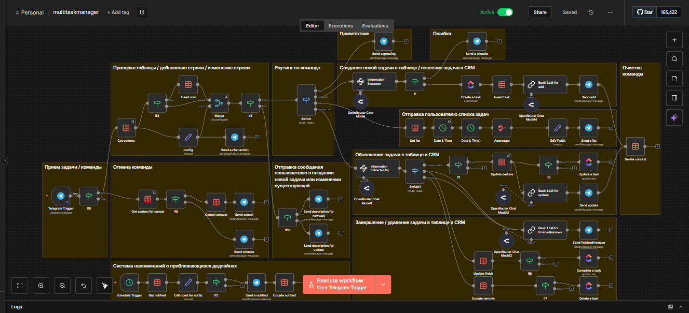
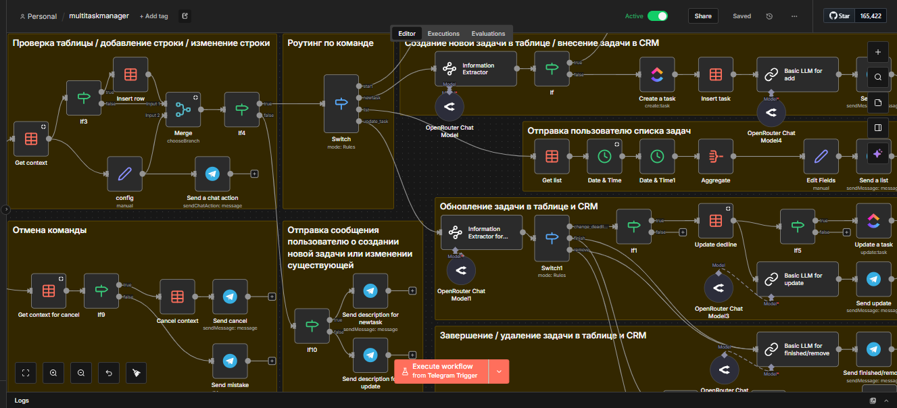
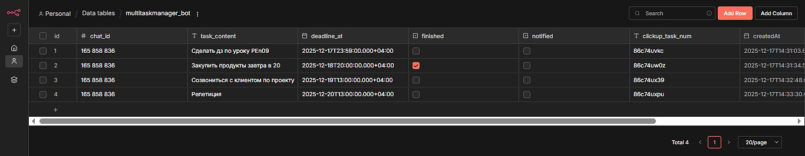
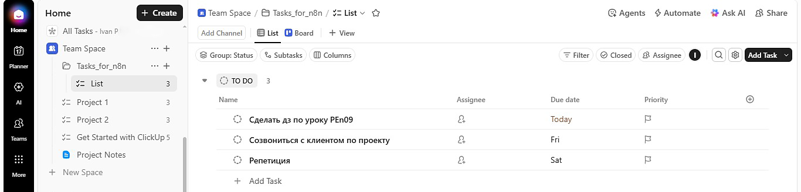
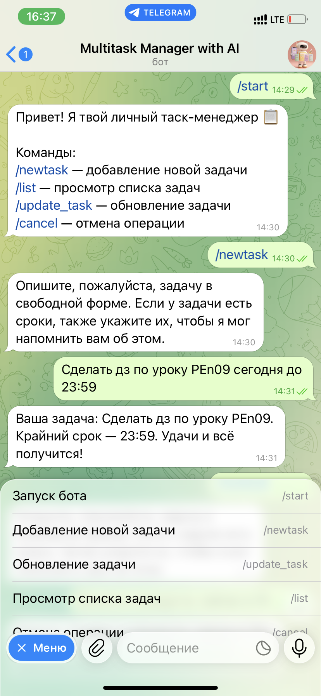
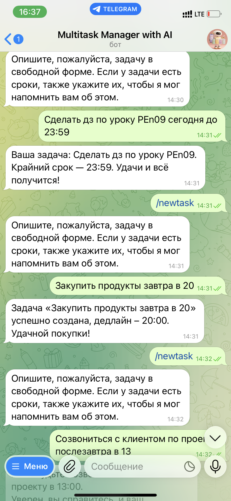
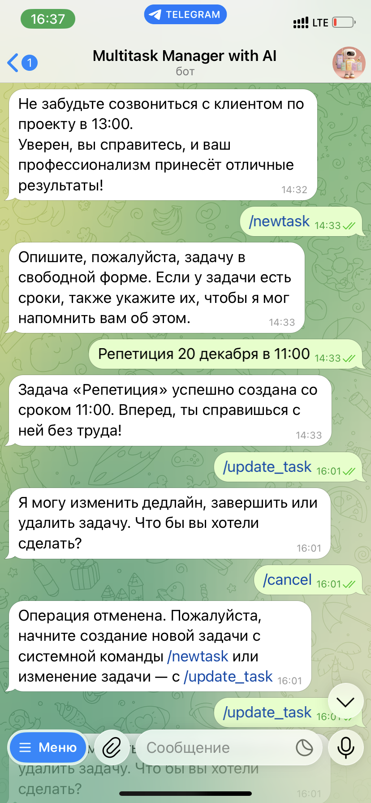
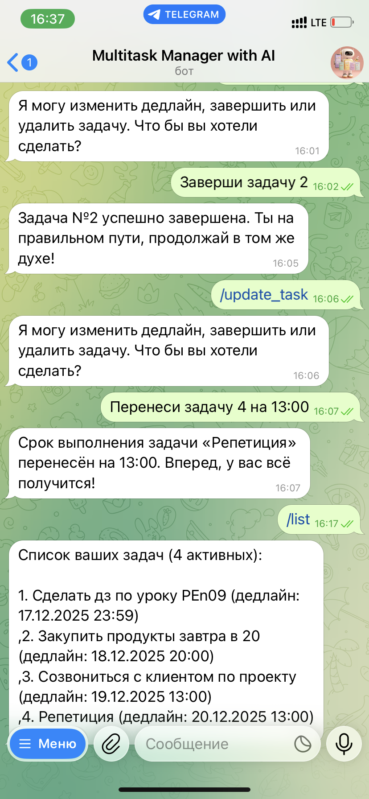

<div align="center">

# 🤖 Multitask AI Manager

[](https://n8n.io/)
[](LICENSE)

Умный менеджер задач с AI-обработкой, интеграцией в CRM и автоматическими напоминаниями о дедлайнах.

</div>

---

## 📋 Описание

Multitask AI Manager — это бот для эффективного управления задачами с использованием искусственного интеллекта.

**Основные возможности:**
- 📝 Создание задач голосом или текстом
- 🔄 Обновление задач (изменение дедлайна, завершение, удаление)
- 📊 Просмотр списка активных задач
- ⏰ Автоматические напоминания за 30 минут до дедлайна
- 🔗 Интеграция с CRM (ClickUp)
- 🤖 AI-обработка команд и задач

---

## 🛠 Технологии

- **n8n** — платформа автоматизации
- **Telegram** — пользовательский интерфейс
- **OpenRouter** — AI-понимание текста
- **ClickUp** — CRM для управления задачами
- **n8n Data Table** — встроенная база данных

---

## 🚀 Быстрый старт

### 1. Клонируйте репозиторий

```bash
git clone https://github.com/your-username/multitask-ai-manager.git
cd multitask-ai-manager
```

### 2. Настройте переменные окружения

```bash
# Копируем пример файла переменных
cp .env.example .env

# Редактируем .env и добавляем ваши API-ключи
nano .env
```

### 3. Импортируйте workflow в n8n

1. Откройте ваш n8n instance
2. Перейдите в Settings → Import
3. Загрузите файл workflow.json
4. Создайте credentials в n8n:
   - Telegram API — для бота (токен из TELEGRAM_BOT_TOKEN)
   - OpenRouter API — для AI (ключ из OPENROUTER_API_KEY)
   - ClickUp API — для CRM (токен из CLICKUP_API_TOKEN)

### 4. Настройте Telegram-бота

1. Напишите @BotFather в Telegram
2. Создайте нового бота: /newbot
3. Скопируйте API-токен бота
4. Добавьте токен в файл .env и в credentials n8n
5. Настройте webhook или используйте polling в n8n

---

## 📁 Структура проекта
```
multitask-ai-manager/
├── .gitignore           # Исключение чувствительных файлов
├── .env.example         # Шаблон переменных окружения
├── .env                 # Ваши переменные (создаётся вручную)
├── README.md            # Документация
├── workflow.json        # n8n workflow
├── LICENSE              # MIT License
└── docs/
    └── images/          # Скриншоты
```
---

## 🔧 Быстрое изменение проекта под ваши задачи

### Замена базы данных

Текущая реализация использует n8n Data Table. Вы можете легко переключиться на:

| База данных   | Преимущества                    |
|---------------|---------------------------------|
| Airtable      | Удобный UI, бесплатный план     |
| PostgreSQL    | Мощная реляционная БД           |
| MongoDB       | Документоориентированная БД     |
| Notion        | Интеграция с Notion Database    |
| Google Sheets | Простота, совместная работа     |

### Замена пользовательского интерфейса

Telegram — не единственный возможный UI. Проект легко адаптируется под:

| Платформа | Описание                     |
|-----------|------------------------------|
| Telegram  | Текущая реализация           |
| Slack     | Корпоративный мессенджер     |
| Discord   | Для сообществ и команд       |
| WhatsApp  | Широкое распространение      |
| Web Widget| Виджет на сайте              |
| Email     | Управление через почту       |

### Замена CRM

ClickUp можно заменить на:

| CRM     | Особенности                     |
|---------|---------------------------------|
| ClickUp | Текущая реализация              |
| Notion  | Гибкость и простота             |
| Asana   | Управление проектами            |
| Todoist | Простота для личных задач       |
| Trello  | Канбан-доски                    |
| Jira    | Для IT-команд                   |

### Замена триггера

По умолчанию workflow запускается сообщением из Telegram. Вы можете изменить триггер на:

| Триггер      | Описание                                      |
|--------------|-----------------------------------------------|
| Telegram     | Текущая реализация                            |
| Email        | Получение задачи на почту                     |
| Webhook      | HTTP-запрос от любой системы                  |
| Schedule     | По расписанию (например, ежедневно в 9:00)    |
| Web Form     | Веб-форма на сайте                            |
| Calendar     | Событие из Google Calendar                    |

#### Пример настройки Email-триггера

1. Замените узел **Telegram Trigger** на **Email Trigger (IMAP)**
2. Настройте подключение к почтовому серверу
3. Добавьте фильтр писем с определённым заголовком или темой

#### Пример настройки Webhook-триггера

1. Замените узел **Telegram Trigger** на **Webhook**
2. Получите URL вебхука
```bash
# Webhook URL будет доступен после импорта workflow
https://your-n8n-instance.com/webhook/your-path
```
3. Настройте аутентификацию при необходимости
4. Добавьте токен в переменную `` `WEBHOOK_AUTH_TOKEN` `` в файле `` `.env` `` для защиты вебхука

---

## 📸 Скриншоты

### Workflow в n8n



### Фрагмент workflow — обработка команд



### Таблица с задачами



### ClickUp — задачи в CRM



### Интерфейс Telegram-бота






---

## 🔧 Workflow Overview
```
Telegram Trigger → Get Context → If3 (новый/существующий пользователь)
                        ↓
            ┌─────────┴─────────┐
            ↓                   ↓
      Insert Row (новый)   Merge (существующий)
            ↓                   ↓
            └─────────┬─────────┘
                      ↓
                If4 (команда?)
                        ↓
        ┌──────────────┼──────────────┐
        ↓              ↓              ↓
   /start, /list   /newtask      /update_task
        ↓              ↓              ↓
   Send Greeting   Information  Information Extractor
                        Extractor          ↓
                        ↓          Switch1 (действие)
                        ↓              ↓
                  Create Task    ┌─────┼─────┐
                        ↓        ↓     ↓     ↓
                  Insert Task  finish change  remove
                        ↓              ↓     ↓     ↓
                  Basic LLM   Update   Update Update
                        ↓      finish  dedline remove
                        ↓              ↓     ↓     ↓
                  Send Add    Complete Update  Delete
                                Task    Task   Task
                                    ↓     ↓     ↓
                                ClickUp ClickUp ClickUp
```

---

## 🤝 Contributing

1. Forkните репозиторий
2. Создайте ветку (git checkout -b feature/amazing-feature)
3. Commitните изменения (git commit -m 'Add amazing feature')
4. Pushните в ветку (git push origin feature/amazing-feature)
5. Откройте Pull Request

---

## 📄 Лицензия

MIT License — подробности в файле [LICENSE](LICENSE)

---

## 📞 Контакты

**Автор**: Ivan P  
**Telegram**: [@nonoyessure](https://t.me/nonoyessure)

---

<div align="center">
  Сделано с ❤️
</div>
